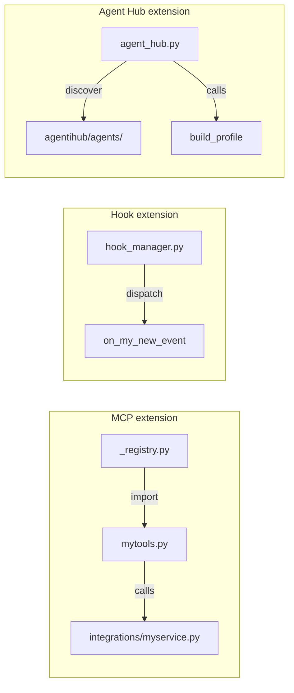

# Extending AgentiHooks
{: .no_toc }

AgentiHooks is designed to be extended. This page covers the two main extension points: adding a new MCP tool category and adding a new hook handler.

## Table of contents
{: .no_toc .text-delta }

1. TOC
{:toc}

---

## Adding a new MCP tool category

### 1. Create the module

Create `hooks/mcp/<category>.py`. Use the `register()` pattern with `@server.tool()` decorators:

```python
# hooks/mcp/mytools.py

from mcp.server import Server

def register(server: Server) -> None:
    """Register mytools category tools."""

    @server.tool()
    def my_new_tool(param1: str, param2: int = 0) -> str:
        """
        One-line description of what this tool does.
        Returns JSON with result fields.
        """
        import json
        return json.dumps({"success": True, "result": "..."})
```

Key conventions:
- The module must define a `register(server: Server)` function
- Each tool is a nested function decorated with `@server.tool()`
- Tools return JSON strings (use `json.dumps`)
- Parameter types are inferred by MCP from type annotations
- The docstring becomes the tool description in Claude's tool list

### 2. Register in `_registry.py`

Add the category:

```python
# hooks/mcp/_registry.py

CATEGORY_REGISTRY = {
    # ... existing categories ...
    "mytools": "hooks.mcp.mytools",
}
```

The key is used in `MCP_CATEGORIES`. The value is the Python module path.

### 3. Add an integration (optional)

For external services, add a client under `hooks/integrations/`:

```python
# hooks/integrations/myservice.py

import os

class MyServiceClient:
    def __init__(self):
        self.token = os.environ.get("MYSERVICE_TOKEN", "")
        if not self.token:
            raise ValueError("MYSERVICE_TOKEN is required")

    def do_thing(self, param: str) -> dict:
        return {"result": "..."}
```

### 4. Add documentation

Create `docs/mcp-tools/<category>.md` following the per-category template. Update the tables in `docs/mcp-tools/index.md` and `docs/reference/configuration.md`.

### 5. Test

Add tests in `tests/test_mcp_<category>.py`:

```python
from mcp.server import Server
from hooks.mcp.mytools import register

def test_my_new_tool():
    server = Server("test")
    register(server)
    # assert tool is registered and returns expected JSON
```

---

## Adding a new hook handler

### 1. Add the handler in `hook_manager.py`

```python
def on_my_new_event(payload: dict) -> None:
    """Handle MyNewEvent."""
    session_id = payload.get("session_id", "unknown")
    log(f"MyNewEvent fired", session_id=session_id)
    # ... your logic ...
```

### 2. Register in the dispatcher

In `hook_manager.py`, add to the `HANDLERS` dict:

```python
HANDLERS = {
    "SessionStart": on_session_start,
    # ... existing handlers ...
    "MyNewEvent": on_my_new_event,
}
```

### 3. Wire in settings

Add the event to `profiles/_base/settings.base.json`:

```json
{
  "hooks": {
    "MyNewEvent": [
      {
        "hooks": [
          {"type": "command", "command": "python3 -m hooks"}
        ]
      }
    ]
  }
}
```

Re-run `agentihooks global` to apply the updated settings.

### 4. Exit code behavior

- Exit `0` (or no call to `sys.exit`) — allow Claude Code to proceed
- Exit `2` — block the action (Claude Code injects stdout as a warning)

Exit code `2` is only meaningful for `PreToolUse` and `UserPromptSubmit`.

---

---

## Adding agents via Agent Hub

Agent Hub (`scripts/agent_hub.py`) is a third extension point: it lets you maintain agent definitions in a **separate repo** (an "agentihub") and build them through the same `_base` pipeline as local profiles.

### When to use Agent Hub

- Agent identities (CLAUDE.md, workflows, evaluation) are **private** and shouldn't live in this open-source repo
- Multiple teams share agentihooks but need **different agent personas**
- You want a clean separation between the **build system** (agentihooks) and **agent definitions** (agentihub)

### agentihub agent structure

```
agentihub/agents/<name>/
├── agent.yml                  # Same schema as profile.yml
├── settings.overrides.json    # Env overrides (merged with _base)
├── __init__.py                # Package marker
├── .claude/
│   └── CLAUDE.md              # Agent personality + workflow instructions
└── evaluation/                # Eval harness (future)
    ├── eval.yml               # Criteria, weights, thresholds
    └── cases/                 # Test cases
```

### How it works

```bash
python scripts/agent_hub.py /path/to/agentihub
```

1. Discovers all `agents/*/agent.yml` in the hub
2. Copies each agent directory into `profiles/`
3. Renames `agent.yml` → `profile.yml`
4. Calls `build_profile()` — generates `settings.json`, `.mcp.json`, symlinks shared skills/agents/commands

The result is a standard profile that agenticore discovers via `AGENTICORE_AGENTIHOOKS_PATH`.

### Data flow

```
agentihub/agents/publishing/     →  agent_hub.py  →  profiles/publishing/
  agent.yml                                            profile.yml (renamed)
  settings.overrides.json                              settings.overrides.json
  .claude/CLAUDE.md                                    .claude/CLAUDE.md (copied)
                                                       .claude/settings.json (generated)
                                                       .mcp.json (generated)
                                                       .claude/commands → symlink
```

---

## Architecture reference

The `register()` pattern keeps each category self-contained. `_registry.py` maps string keys to module paths, and `build_server()` in `hooks/mcp/__init__.py` imports and calls `register()` for each active category at startup.

Hook handlers follow the same pattern: `hook_manager.py` dispatches by `hook_event_name` string, and each handler is a standalone function.

Agent Hub follows a similar pattern: `agent_hub.py` discovers agents, copies them, and delegates to `build_profile()` — no new build logic, just a bridge between repos.


