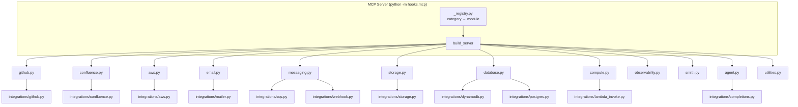

# MCP Tools

The AgentiHooks MCP server exposes **45 tools** across **12 categories**. The server is started by `python -m hooks.mcp` and registered automatically during `agentihooks global`.

## Categories

| Category | Tools | Description |
|----------|------:|-------------|
| [GitHub](github.md) | 5 | Token management, clone, PR creation, repo info, git summary |
| [Confluence](confluence.md) | 9 | Full CRUD, markdown docgen, validation, connection test |
| [AWS](aws.md) | 4 | Profile listing, account ID lookup, account discovery |
| [Email](email.md) | 2 | SMTP send with plain text / HTML / markdown options |
| [Messaging](messaging.md) | 3 | SQS message send + state load, webhook HTTP calls |
| [Storage](storage.md) | 2 | S3 upload, filesystem delete (restricted to /tmp) |
| [Database](database.md) | 3 | DynamoDB put, PostgreSQL insert + execute |
| [Compute](compute.md) | 1 | AWS Lambda invocation (sync + async) |
| [Observability](observability.md) | 7 | Timers, metrics collector, log write, container log tailing |
| [Smith](smith.md) | 4 | Command builder integration (list, get prompt, build, execute) |
| [Agent](agent.md) | 1 | Remote agent completions with model presets |
| [Utilities](utilities.md) | 4 | Mermaid validation, markdown writer, env vars, tool listing |

---

## Filtering categories

By default, all 12 categories load. Use `MCP_CATEGORIES` to restrict:

```bash
# Load only GitHub and utilities tools
MCP_CATEGORIES=github,utilities python -m hooks.mcp
```

Valid values (comma-separated):

```
github, confluence, aws, email, messaging, storage, database,
compute, observability, smith, agent, utilities
```

Setting `MCP_CATEGORIES=all` (the default) loads everything.

---

## Architecture



---

## Discovering available tools

At runtime, call `hooks_list_tools()` to see exactly which tools are active:

```
hooks_list_tools()
```

Returns: `total_tools`, `available_categories`, and a per-category tool list.
