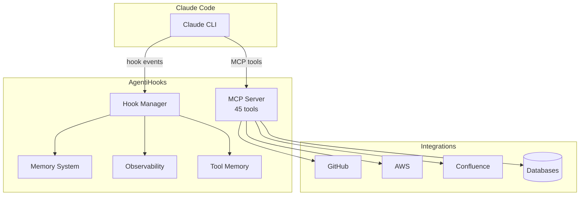

# AgentiHooks
{: .fs-9 .fw-700 }

Hook system and MCP tool server for Claude Code agents. Event-driven lifecycle hooks, 45 MCP tools across 12 categories, and profile-based configuration.
{: .fs-5 .text-grey-dk-100 .mb-6 }

<div class="hero-actions text-center mb-8" markdown="0">
  <a href="#quick-start" class="btn btn-primary fs-5 mr-2">Get Started</a>
  <a href="https://github.com/The-Cloud-Clock-Work/agentihooks" class="btn fs-5" target="_blank">View on GitHub</a>
</div>

[](https://github.com/The-Cloud-Clock-Work/agentihooks/blob/main/LICENSE)
[](https://github.com/The-Cloud-Clock-Work/agentihooks/actions/workflows/ci.yml)
[](https://python.org)
{: .text-center .mb-8 }

---

## What is AgentiHooks?

AgentiHooks provides two capabilities for Claude Code agents:

1. **Lifecycle Hooks** — Event-driven handlers that fire on SessionStart, SessionEnd, PreToolUse, PostToolUse, Stop, and other Claude Code hook events. Automatically log transcripts, inject context, record tool errors, and auto-save session summaries to memory.

2. **MCP Tool Server** — 45 tools across 12 categories (GitHub, AWS, Confluence, email, messaging, storage, database, compute, observability, agent completions, utilities, and command builder) that extend what Claude Code agents can do.

---

## Quick Start
{: #quick-start }

AgentiHooks is designed to run inside the [agenticore](https://github.com/The-Cloud-Clock-Work/agenticore) container, but can also be used standalone:

```bash
# Clone the repo
git clone https://github.com/The-Cloud-Clock-Work/agentihooks
cd agentihooks

# Install dependencies
pip install -e ".[all]"

# Run the MCP tool server
python -m hooks.mcp

# Run hooks (typically invoked by Claude Code via settings.json)
python -m hooks
```

---

## Hook Events

| Event | When It Fires | What AgentiHooks Does |
|-------|--------------|----------------------|
| `SessionStart` | New Claude Code session begins | Inject context directory + token limit |
| `SessionEnd` | Session ends normally | Log metrics, cleanup |
| `PreToolUse` | Before any tool executes | Log transcript, inject tool memory |
| `PostToolUse` | After tool completes | Record errors for learning |
| `Stop` | Agent stops (success or error) | Error notification, transcript scan, auto-save memory |

---

## MCP Tool Categories (12)

| Category | Tools | Description |
|----------|-------|-------------|
| **GitHub** | 5 | Token management, clone, PR creation, repo info |
| **AWS** | 4 | Profile listing, account discovery |
| **Confluence** | 9 | Full CRUD, markdown docgen, validation |
| **Email** | 2 | SMTP send, markdown-to-HTML |
| **Messaging** | 3 | SQS, webhook |
| **Storage** | 2 | S3 upload, filesystem delete |
| **Database** | 3 | DynamoDB, PostgreSQL |
| **Compute** | 1 | Lambda invocation |
| **Observability** | 7 | Timers, metrics, logging, container logs |
| **Agent** | 1 | Completions endpoint with presets |
| **Smith** | 4 | Command builder integration |
| **Utilities** | 4 | Mermaid validation, markdown writer, env, tool listing |

---

## Architecture



---

## Profile System

AgentiHooks uses profiles to configure different agent personalities:

```
profiles/
├── _base/
│   └── settings.base.json    # Shared permissions + hooks
├── default/
│   ├── profile.yml            # Model, turns, timeout, categories
│   ├── .mcp.json              # Generated MCP config
│   └── .claude/
│       ├── CLAUDE.md          # Agent system prompt
│       └── settings.json      # Generated settings
└── coding/
    └── ...                    # Same structure
```

Build profiles:
```bash
python scripts/build_profiles.py
```

---

## Related Projects

| Project | Description |
|---------|-------------|
| [agenticore](https://github.com/The-Cloud-Clock-Work/agenticore) | Claude Code runner and orchestrator (uses agentihooks) |
| [agentibridge](https://github.com/The-Cloud-Clock-Work/agentibridge) | MCP server for session persistence and remote control |

---

<p align="center">
  Built by <a href="https://github.com/The-Cloud-Clock-Work">The Cloud Clock Work</a> &middot;
  <a href="https://github.com/The-Cloud-Clock-Work/agentihooks/blob/main/LICENSE">MIT License</a>
</p>
